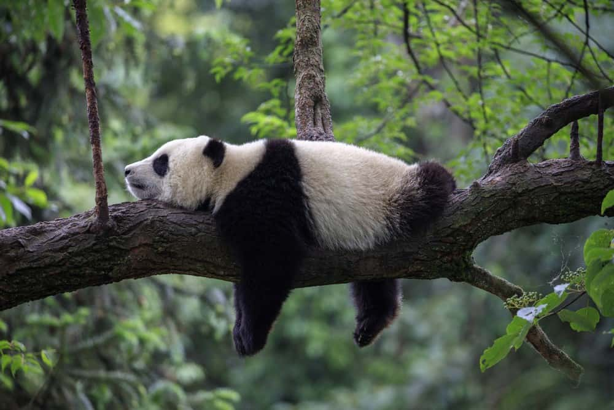

# **Sumário**

1. Introdução  
2. Dados e Metodologia  
3. Resultados  
4. Discussão  
5. Conclusão  

---

# **1. Introdução**

- O sono em mamíferos varia amplamente entre espécies  
- Diferenças associadas a fatores:
  - fisiológicos  
  - ecológicos  
  - comportamentais  
- Objetivo: **investigar determinantes do tempo total de sono** via:
  - análise exploratória
  - regressão linear
  - diagnóstico
  - seleção de variáveis
  - validação cruzada

---

# **Estrutura do Relatório**

- **Seção 2:** fontes de dados e metodologia  
- **Seção 3:** resultados empíricos  
- **Seção 4:** discussão dos achados  
- **Seção 5:** conclusões  

---

# **2. Dados e Metodologia**

## Base de dados

- Dataset: *Sleep in Mammals (Kaggle)*
- 39 espécies  
- 62 observações  
- **Variável resposta:** `total_sleep` (h/dia)

### Variáveis explicativas

- body_wt  
- brain_wt  
- life_span  
- gestation  
- predation  
- exposure  
- danger  
- dreaming, non_dreaming  

---

# **Pré-processamento**

- Checagem de valores ausentes  
- Remoção de casos inviáveis  

---

# **Análise Exploratória**

Incluiu:

- estatísticas descritivas  
- histogramas e boxplots  
- matriz de correlação  
- inspeção de outliers  

---

# **Ajuste do Modelo Linear**

- Modelo linear múltiplo  
- Remoção de variáveis com alta colinearidade  
- Verificação dos pressupostos:
  - normalidade dos resíduos  
  - homocedasticidade  
  - independência  

---

# **Diagnóstico — Teste Breusch–Pagan**

$$ BP = n R^2_{\text{aux}} \sim \chi^2_k $$

Avalia heterocedasticidade.

---

# **Transformação Box–Cox**

$$
y^{(\lambda)} = 
\begin{cases}
\frac{y^\lambda - 1}{\lambda}, & \lambda \neq 0 \\
\ln(y), & \lambda = 0
\end{cases}
$$

Utilizada quando a variância dos resíduos não era constante.

---

# **Seleção de Variáveis**

### AIC – Stepwise
$$ \text{AIC} = -2\ln(\hat{L}) + 2k $$

### LASSO
Minimiza:

$$
\sum_{i=1}^n (y_i - \hat y_i)^2 + \lambda \sum_{j=1}^p |\beta_j|
$$

---

# **Validação Cruzada**

- **10-fold cross validation**
- **Leave-One-Out (LOOCV)**  
- Métricas:
  - RMSE  
  - MAE  
  - \( R^2 \)  

---

# **3. Resultados**

## Estatísticas Descritivas

---

# **Distribuição da variável resposta**

Dado que estamos tratando de regressão, é desejável que nossa variável
resposta siga a distribuição normal, dado que isso aumentaria as chances
dos nossos erros também serem normais. Portanto, é válido, começar
analisando isso.

- `total_sleep` não é normal  
- Aparência multimodal → subgrupos de mamíferos

---

# **Correlação entre variáveis**

Principais achados:

- body_wt × brain_wt → **r = 0.96**  
- exposure × danger → **r = 0.93**  
- total_sleep × non_dreaming → **r = 0.97**  
- total_sleep correlaciona negativamente com:
  - predation  
  - exposure  
  - danger  
  - body_wt  
  - brain_wt  
  - gestation  
  - life_span  

---

# **Detecção de Outliers**

Histogramas e boxplots revelaram:

- Peso corporal extremamente assimétrico  
- Massa cerebral igualmente assimétrica  
- Algumas espécies muito fora da distribuição (ex.: elefantes, baleias)

---

# **Detecção de Outliers: Predation**

---

# **Detecção de Outliers: Dreaming**

---

# **Detecção de Outliers: Non_dreaming**

---

# **Detecção de Outliers: Life_span**

---

# **Detecção de Outliers: Gestation**

---

# **Detecção de Outliers: Exposure**

---

# **Detecção de Outliers: Danger**

---

# **Detecção de Outliers: Brain_wt**

---

# **Detecção de Outliers: Body_wt**

---

# **Regressão Linear Múltipla** 

Analisadas as correlações entre as variáveis, procedeu-se à construção de um modelo explicativo de regressão linear com múltiplas variáveis. Em particular, as variáveis non_dreaming e dreaming foram removidas por serem preditoras perfeitas da variável resposta. 

---

# **Regressão Linear Múltipla: Cálculo de VIFs** 

Para detecção de multicolinearidade problemática, avaliamos os valores do Fator de Inflação da Variância (VIF) para cada um dos coeficientes ajustados no modelo exposto anteriormente. 
Como critério, utilizamos a regra prática de se considerar valores de VIF superiores a 10.

Dessa forma, identificamos variâncias infladas para coeficientes de quatro variáveis, a saber: danger, predation, brain_wt e body_wt.

---

# **Regressão Linear Múltipla: Cálculo de VIFs**

Dada a detecção de uma provável multicolinearidade prejudicial ao modelo, o número
de variáveis explicativas foi progressivamente reduzido. Para isso, removemos do modelo a variável associada ao maior Fator de Inflação da Variância (VIF), seguindo-se
a isto um novo ajuste. Esse processo foi repetido até que todos os VIFs calculados
estivessem abaixo do limite prático estabelecido.

Finalizado este processo, obtemos o seguinte modelo ajustado: 

---

# **Regressão Linear Múltipla: Cálculo de VIFs**

Note que o novo modelo sofreu uma redução em sua explicabilidade - R² regrediu de 0.58 para 0.47, o que não é desejável, dada a busca por um modelo explicativo do sono em mamíferos. No entanto, observe, a seguir, que os VIFs do modelo convergiram para o limite mínimo (5):

Assim, com intuito de minimizar a degradação da explicabilidade do modelo, optou-se por métodos alternativos para se lidar com a multicolinearidade, mais especificamente: Stepwise e LASSO. 
---

# **Stepwise**

O Stepwise se utiliza do Critério de Informação de Akaike (AIC) como aspecto de decisão pela manutenção ou remoção de variáveis no modelo. Nesta lógica, se a inserção ou remoção de uma explicativa reduz esta métrica no modelo, a ação em questão será tomada. O algoritmo é interrompido quando não há nenhuma ação de remoção ou adição que possa minimizar o AIC. Como resultado, o Stepwise otimizou o AIC (Critério de Informação de Akaike), mas não eliminou a multicolinearidade. Abaixo, o modelo obtido:

VIFs das variáveis independentes:

---

# **LASSO**

Como alternativa, buscamos aplicar o método LASSO (Least Absolute Shrinkage and Selection Operator), mais moderno e robusto, especialmente para modelos com problemas de multicolinearidade. Essa técnica funciona penalizando os coeficientes, utilizando um certo *alpha*. Para escolher o melhor parâmetro, utilizamos **Validação
Cruzada**.

**Resultados**

Abaixo, estão os coeficientes penalizados após execução do método descrito:

---

# **LASSO**
**Modelo ajustado**

Como pode-se observar acima, o LASSO produziu um modelo final, `total_sleep ~ gestation + danger + life_span`,
que é muito mais simples - aspecto desejável - e robusto que os anteriores. Os coeficientes
tanto de danger quanto gestation são estatisticamente significantes. 
---

# **Análise de Resíduos**

A análise de resíduos é essencial para verificar se o modelo linear ajustado atende
aos pressupostos clássicos da regressão: normalidade dos erros, homocedasticidade,
independência e ausência de padrões sistemáticos. 

**Normalidade dos Resíduos** 

A seguir, exibimos o qq-plot do modelo gerado pelo LASSO:

---

# **Análise de Resíduos**

O Teste Shapiro-Wilk, cujos resultados são exibidos abaixo, confirmou a aparente normalidade visível no gráfico qq-plot, a 5% de significância.

---

# **Análise de Resíduos**

**Homocedasticidade**

Note que a linha forma uma curva, indicando que existe não-linearidade. Assim, o modelo
linear atual não parece capturar bem a relação. Observe, também, que a largura dos
pontos varia ao longo da linha horizontal em y=0, configurando indício de heterocedasticidade.

---
# **Análise de Resíduos**

Através do Teste Breusch–Pagan, conforme pode-se verificar na saída do R abaixo, podemos confirmar a detecção de heterocedasticidade significativa:

O p-valor é menor do que 0.05 , então a um nível de 5% de significância
rejeitamos H0 e consideramos que o modelo apresenta heterocedasticidade.

Tendo esses resultados em mente, o ideal é fazermos uma transformação de
variáveis. Uma medida corretiva comum para a não-normalidade e/ou variância
não-constante é transformar a variável resposta Y, criando uma nova
variável Y\*. Para tal, faremos uma transformação Box-Cox.

---

# **Transformação Box-Cox**

A transformação Box–Cox reduziu heterocedasticidade e melhorou normalidade dos resíduos:

Heterocedasticidade: houve melhora significativa, sendo resolvida
em grande parte. Não parece haver padrão no gráfico Residuos vs Valores Preditos.

Normalidade: erros continuam seguindo distribuição
Normal. 

---

# **Bootstrap dos Coeficientes**

Com os problemas de multicolinearidade inexata e heterocedasticidade tratadas, buscamos estimar a incerteza ao redor dos coeficientes ajustados da regressão. Reamostramos para um tamanho amostral igual a 1999. Abaixo, indicamos os resultados para os coeficientes:

---

# **Bootstrap dos Coeficientes**

A seguir, apresentamos o resultado para o intercepto:

---

# **Validação Cruzada**

Após desenvolvermos o modelo explicativo, surgiu a necessidade de elaborar-se um
modelo preditivo, avaliado de acordo com as seguintes etapas:
1. Separação dos dados em conjuntos de treino e teste.
2. Treinamento com o conjunto de treino e aplicação de validação cruzada para
avaliar a performance.
3. Avaliação da performance final com o conjunto de teste.

Anteriormente, estávamos interessados em entender a relação entre nossa variável
resposta total_sleep(horas totais de sono por dia) e as explicativas. Por conta disso,
desejávamos melhorar métricas como o R², avaliar a significância dos coeficientes e
ganhar interpretabilidade na regressão. Agora, nosso objetivo mudou. Queremos usar
as variáveis independentes para predizer novos valores da variável dependente, isto é,
dado que tenhamos uma nova observação, neste caso, a inserção de um novo mamífero
na base, fundamentados nos dados coletados referentes a este, desejamos prever qual
será sua quantidade média de horas de sono.

---
# **Validação Cruzada**

**Resultados do modelo k-folds (k=10)**

Não conseguimos concluir nada olhando para as métricas retornadas (RMSE,
R², MAE) por si só. Dessa forma, pode ser útil comparar com outra versão
apropriada do K-Folds. Como o tamanho da amostra é pequeno (42), podemos
comparar com o método LOOCV, que forma n folds, sendo n o tamanho da
amostra, treinando com n-1 folds e testando em um.

---

# **Validação Cruzada**

**Resultados do modelo LOOCV**

Observe que há aumento no erro quadrático médio (RMSE) e no erro médio absoluto (MAE), mas redução no R² - o que indica menor explicabilidade pelo modelo. Este último não é um grande problema, dado que estamos interessados no caráter preditivo do modelo. Com apenas 42 observações, o método LOOCV gera alta variância nas estimativas, pois cada treino é feito com quase toda a base e cada observação tem grande influência no erro final. Isso tende a aumentar o RMSE e o MAE e reduzir o R². Já o k-fold (k=10) reduz a variância ao usar partições maiores, produzindo estimativas mais estáveis. Por isso, no nosso caso, o 10-fold apresentou erros menores e R² maior, indicando melhor equilíbrio entre viés e variância para esse tamanho de amostra.
Assim sendo, como nosso foco é a capacidade de previsão do modelo, o método k-fold parece ser o mais adequado, o que vai de encontro com a ideia de sua posição como 'padrão ouro' da validação cruzada.

---

# **4. Discussão**

## Principais pontos

- **Espécies mais vulneráveis dormem menos**  
  - Correlações negativas com predation, danger, exposure indicam adaptações comportamentais.
  
- **Características fisiológicas influenciam o sono**
  - mamíferos maiores (body_wt, brain_wt) dormem menos, consistente com literatura evolutiva.

- **Variáveis fortemente colineares**  
  - body_wt e brain_wt praticamente redundantes → redução de preditores necessária.

- **Modelos de regressão tiveram limitações**
  - Amostra pequena  
  - Ausência de linearidade forte para algumas relações  
  - Possível não normalidade dos erros em alguns ajustes

---
# **4. Discussão**

- **Transformação Box–Cox melhorou estabilidade da variância**
  - Especialmente em modelos com body_wt e brain_wt

---

# **Discussão — Modelagem**

### Stepwise (AIC)
- Selecionou conjunto mais parcimonioso  
- Reduziu variáveis ecológicas redundantes  
- Manteve predation/danger como importantes

### LASSO
- Penalizou fortemente brain_wt e life_span  
- Reforçou a importância de gestation e predation

### Validação Cruzada
- LOOCV exibiu maior variabilidade (esperado para n pequeno)
- 10-fold apresentou métricas mais estáveis:
  - menor RMSE  
  - maior \( R^2 \)  

---

# **Implicações Biológicas**

- Mamíferos com maior risco tendem a dormir menos → adaptação evolutiva  
- Mamíferos de maior porte têm menor taxa metabólica relativa → necessitam menos sono  
- Tempo de gestação correlacionou negativamente com total de sono → possível relação metabólica/energética

---

# **5. Conclusão**

- O tempo total de sono em mamíferos é influenciado por variáveis fisiológicas e ecológicas.  
- O modelo linear, após seleção e regularização, capturou bem as principais tendências.  
- Há evidências robustas de relação entre vulnerabilidade predatória e redução do sono.  
- Limitações:
  - amostra pequena  
  - dados incompletos  
  - colinearidade estrutural  

---
# **Obrigado!**  

---

